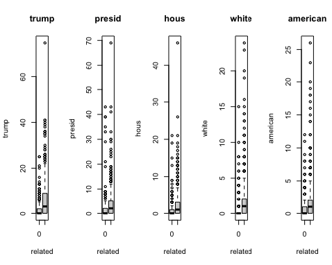
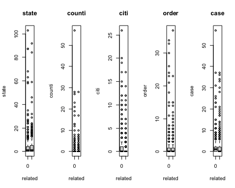
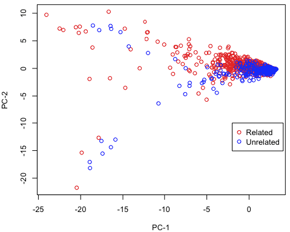

```{r setup, include=FALSE}
knitr::opts_chunk$set(echo = TRUE)
```
## Part 1: Introduction and description of the data.

Our project aims to explore whether and how mainstream news media in the U.S. plays a role in the polarization of public's attitudes and behaviors in response to COVID-19. Elite communication, such as White House briefings and politicians' Tweets, has been found to increase the polarization between left-leaning and right-leaning public in terms of attitudes and behaviors in response to COVID-19. However, it is still unknown whether news media amplify or narrow down the effects of elite communication on polarization. 

To answer this question, we analyze the content of news articles about elite communication about COVID-19. We collected news articles from ten news media, including newspapers (i.e., New York Times, Washington Post, Wall Street Journal, and USA Today) and cable network news (i.e., ABC News, NBC News, CBS News, CNN, Fox News, and MSNBC News).To obtain the news articles, we searched the keywords in the GDELT database that monitors the world's broadcast, print, and web news from every country in more than 100 languages. We used two sets of keywords to capture the news articles about the White House responses to COVID-19. The first set of keywords were used to query White House, including "white house", "trump", "coronavirus task force", "press secretary", "McEnany", "vice president", and "pence". The second set of keywords were used to query press briefing, including "white house briefing", "coronavirus briefing", "press conference", "task force briefing", "news briefing", "press briefing", "daily briefing", "weekly briefing", and "news conference". Both sets of keywords were used in searching for articles that mentioned "covid" or "coronavirus" at least three times. The GDELT database returned 8588 news articles that met these criteria from January 20, 2020 to September 29, 2020. Part of these articles that were captured by the keywords are not relevant to the topic of this project and therefore were removed from the list. For example, an NBC news on April 30, 2020 titled "Biden calls on Trump to lower White House flag to honor coronavirus victims" was captured through the keywords search but not relevant to the topic of this project.

We then used the Python package "Scrapy" to scrape the full text of these articles. We prepared two sets of full text: one is at the article-level, and the other is at the paragraph-level. The article-level full text will be used for differentiating relevant articles from irrelevant articles. Though we have removed some irrelevant articles from simple eyeballing, a more thorough filtering through binary classification will help us get a cleaner dataset. The paragraph-level dataset will be used for content classification. We will randomly select 2000 paragraphs and manualy label them based on the Extended Parallel Processing Model (EPPM) (@witte1992putting; @witte1994fear). The EPPM framework predicts that in order to effectively persuade people to adopt a recommended health practice, the messages need to invoke certain levels of perception of both threats and efficacies. Therefore, we manually labeled our samples into the following categories: (1) threats/impacts, (2) responses/actions, (3) severity, (4) susceptibility, (5) self-efficacy, (6) external efficacy, (7) response efficacy, (8) public health, (9) economy, (10) education, (11) political evaluation, (12) racial conflict, (13) international relations/foreign policies, (14) positive, (15) negative. The first 13 categories will be labeled as either 0(No) or 1(Yes). The 14 and 15 categories will be labeled as three levels 0(none), 1(some part of the paragraph is positive/negative OR the overall sentiment of the paragraph is mildly positive/negative), or 2(most parts of the paragraph are positive/negative OR the overall sentiment of the paragraph is extremely/intensively positive/negative). All the 15 categories are not mutually exclusive. That is, one paragraph can be labeled as multiple categories. 

## Part 2: A detailed problem statement (question of interest).

The overarching goal of the project is to see whether news media amplify or narrow down the polarization in health attitudes and behaviors. Polarization is far more than just within political issues. Research has found that there is polarization between Democrats and Republicans in their health-related attitudes and behaviors. For example, de Bruin, Saw, and Goldman (2020) found that Democrats perceived higher risks associated with COVID-19 than Republicans (@de2020political).Similarly, van Holm, Monaghan, Shahar, Messhina, and Surprenant (2020) found that Democrats made fewer trips than Republicans and were more likely to change their behaviors in ways recommended by public health experts and governors (@van2020impact). Though scholars have found associatations between media consumption and polarization in health-related atttitudes and behaviors, there lacks empirical evidence of the mechanisms of how news media will play a role in the polarization process. This project will fill in the gap by analyzing the content of the news articles and incorporating daily surveys that keep tracking American's health attitudes and behaviors (this part will not be included in the final project for STAT6500).

## Part 3: Exploratory Data Analysis

Our initial EDA focused on the first problem, that of classifying the articles into "relevant" or "irrelevant." We focused on finding the words that were most likely to be helpful in separating the relevent articles from the irrelevent, using a randomly selected subsample of 1022 articles, which were classified by hand. 

Below are plots of the 5 words that appear the most frequently in related articles, versus non-related. 

```{r echo=FALSE, fig.cap="Words Associated with Relevant Articles", out.width = '50%', fig.align='center'}

```

\newpage

And for the 5 words that appear most frequently in non-related articles, versus related: 

```{r echo=FALSE, fig.cap="Words Associated with Irrelevant Articles", out.width = '50%', fig.align='center'}

```

These give a sense of what variables we might focus on in order to classify articles as irrelevant or relevant.   

We also conducted a principal component analysis on the article data. The first two principal components together explain about 45% of the variation in the data. Here is a plot of the first and second principal component scores:   

```{r echo=FALSE, fig.cap="Principal Component Scores", out.width = '50%', fig.align='center'}

```

From this plot, there does appear to be a difference between the two classes of articles on the first two P.C. scores (especially, the related articles tend to score higher on the 2nd PC); however, there is also a good deal of overlap, as can be seen. This suggests that reducing the data dimension to two PC's will likely not be sufficient for classification. 

\newpage

## Part 4: Methodology

In this section, we'll outline some of the methods we plan to use tackle the various goals of our project. 

### Text-Categorization With Multi-label Learning

One of the main goals of our project is to be able to perform text categorization on the level of paragraphs using selected features (tf-idf). The task of text-categorization falls naturally into the realm of multi-label learning, since, each document may belong to several predefined categories [@mlknn]. As an example, paragraphs that can be assigned to the category of "threats/impacts" might also fall appropriately into the category of "responses/actions". In the following sections, we'll provide an overview & introduction to the multi-label learning paradigm, discuss benefits of utilizing MLL algorithms and present two such algorithms we plan to utilize: ML-KNN and BP-MLL.

### Multi-Label Learning: Advantages and an Introduction

In this section, we'll briefly discuss the framework for and benefits of multi-label learning. To start, we consider the question: "Why use MLL algorithms?". Given a multi-label discrimination problem involving $Q$ labels, the naive approach is to train a sequence of independent binary classifiers (one per category).However, this kind of method does not consider the correlations between the different labels of each instance and the expressive power of such a system can be weak [@mlknn; @bpmll].

Next, let's begin to enter the world of multi-label learning (MLL). Before we discuss the ML-KNN and BP-MLL approaches, we need to define some preliminary concepts and terminology. Let $\mathcal{X}$ denote the domain of instances and $\mathcal{Y} = \{1, 2, ... , Q\}$ be the finite set of labels. We note that while our goal is ultimately to learn a function, $h: \mathcal{X} \mapsto 2 ^ {\mathcal{Y}}$ which optimizes some evaluation metric, it is often useful to rather focus on learning a real-valued function of the form $f: \mathcal{X} \times \mathcal{Y} \mapsto \mathbb{R}$ [@mlknn]. This is similar to standard approaches in single-lable classification such as logistic regression where we try to learn some measure of the probability of belonging to a class, as opposed to a binary valued function. The intention is to learn $f$, such that, given an instance $x_i \in \mathcal{X}$, $f(x_i,y_1) > f(x_i, y_2)$ for any $y_1 \in Y_i$ and $y_2 \notin Y_i$, so that labels in $x_i$'s label set can be separated from those not. 

The multi-label classifier corresponding to $f$ can then be derived by $h(x_i) = \{y \textrm{ } | \textrm{ }f(x_i, y) > t(x_i), \textrm{ } y \in \mathcal{Y}\}$ where $t(\cdot)$ is a threshold function. The threshold function is usually set to be the constant zero function, however other alternatives exist and we plan to potentially explore some of these as well. In the next two sections, we'll give brief introductions to two of the MLL algorithms we plan to utilize.

### ML-KNN: A Lazy Learning Approach to MLL
We now give a brief overview of the methods presented in @mlknn. Again, we need to develop some notation. Given an instance $x$ and its label set $Y \subseteq \mathcal{Y}$, let $\vec{y}_x$ be the category vector for $x$. Namely, the $\ell$-th component, $\vec{y}_x(\ell) (\ell \in \mathcal{Y})$ takes the value of $1$ if $\ell \in Y$ and $0$ otherwise. Furthermore, we define a membership counting vector $\vec{C}_x(\ell) = \sum_{a \in N(x)} \vec{y}_a(\ell)$, $\ell \in \mathcal{Y}$ (where $N(x)$ denotes the set of K nearest neighbors of $x$).

We need two more definitions and then we can outline the procedure. The first, given a test instance $t$, let $H_1^{\ell}$ be the event that $t$ has label $l$ ($H_0^{\ell}$ the event that $t$ does not). And the second, let $E_j^{\ell}$ $(j \in \{0, 1, ... , K\})$ denote the event that there are exactly $j$ instances which have label $\ell$, among  the K nearest neighbors. Now, $\vec{y}_t$ is determined as follows. For $\ell \in \mathcal{Y}$: 

\begin{align*}
  \vec{y}_t(\ell) &= \textrm{argmax}_{b \in \{0, 1\}} \mathbb{P}\left(H_b^{\ell} | E_{\vec{C}_t(\ell)}\right) \\
  &= \textrm{argmax}_{b \in \{0, 1\}} \frac{\mathbb{P}\left(H_b^{\ell}\right) \cdot \mathbb{P}\left(E_{\vec{C}_t(\ell)}^\ell | H_b^{\ell}\right)}{\mathbb{P}\left(E_{\vec{C}_t(\ell)}^{\ell}\right)} \\
  &= \textrm{argmax}_{b \in \{0, 1\}} \mathbb{P}\left(H_b^{\ell}\right) \cdot \mathbb{P}\left(E_{\vec{C}_t(\ell)}^\ell | H_b^{\ell}\right)
\end{align*}

where the second equality follows due to Baye's rule. Furthermore, we define:

$$
  \vec{r}_t(\ell) = \mathbb{P}\left(H_1^{\ell} | E_{\vec{C}_t(\ell)}\right)
$$

So far, this is similar to the way in which we approximate the Baye's Optimal Classifier using the single label KNN algorithm. However, the approximation of $\mathbb{P}\left(H_b^{\ell}\right)$ and $\mathbb{P}\left(E_{\vec{C}_t(\ell)}^{\ell}\right)$ differs in key ways. In fact, we approximate these values using a bayesian modeling approach (details not discussed here). Next, we'll introduce a neural network approach to MLL.

### BP-MLL (Back Prop for Multi-Label Learning)

Inspired by biological nervous systems, neural networks date back to the first half of the 20$^{th}$ century with works such as those by McCulloch and Pitts [@mpnetworks]. In the subsequent two decades, much work was done on single layer networks such as Rosenblatt's Perceptron model for supervised learning [@Haykin]. However, the lack of hidden units restricted it's usefulness to linearly separable problems, excluding the possibility of learning even simple functions like XOR.  In the early 1980s, research on neural networks resurged largely due to successful learning algorithms for multi-layer neural networks [@bpmll]. Networks for various tasks including computer vision, associative memory, representation learning, NLP, etc. have since been developed, studied and used.

For our purposes, we will utilize standard multi-layer feed-forward networks with tanh() activations adapted for multi-label learning. We'll briefly mention the naive approach to multi-label learning with such networks before presenting the novel adaptation given in @bpmll. Namely, assuming $\mathcal{X} \in \mathbb{R}^d$, one could simply use a multi-layer network with $d$ input units and $Q$ tanh() or sigmoid output units. Then, training proceeds as usual with either an MSE or cross-entropy loss function. This, however, ignores the relationships between labels. 

In order to improve upon this deficiency, the bp-mll algorithm utilizes a different loss function. The bp-mll loss function is given by:

$$
  E = \sum_{i = 1}^m E_i = \sum_{i = 1}^m \frac{1}{|Y_i| |\overline{Y}_i|} \sum_{(k,l) \in Y_i \times \overline{Y}_i} \exp(-(c_k^i - c_l^i))
$$
where $\overline{Y}_i$ is the complementary set of $Y_i$ in $\mathcal{Y}$. Then, learning proceeds as usual with gradient descent and back prop (we won't derive the details here). On the task of text categorization, bp-mll tends to outperform the naive approach using standard metrics. However, we note that the computation time necessary for training can well exceed it [@bpmll].

While ML-KNN and BP-MLL are the two approaches we have identified so far, we may wind up including others.

# References

